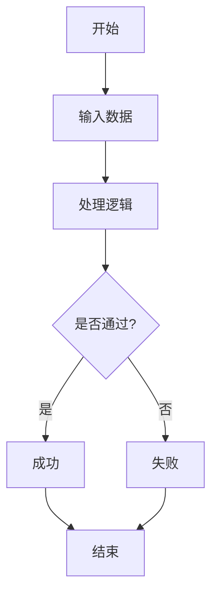
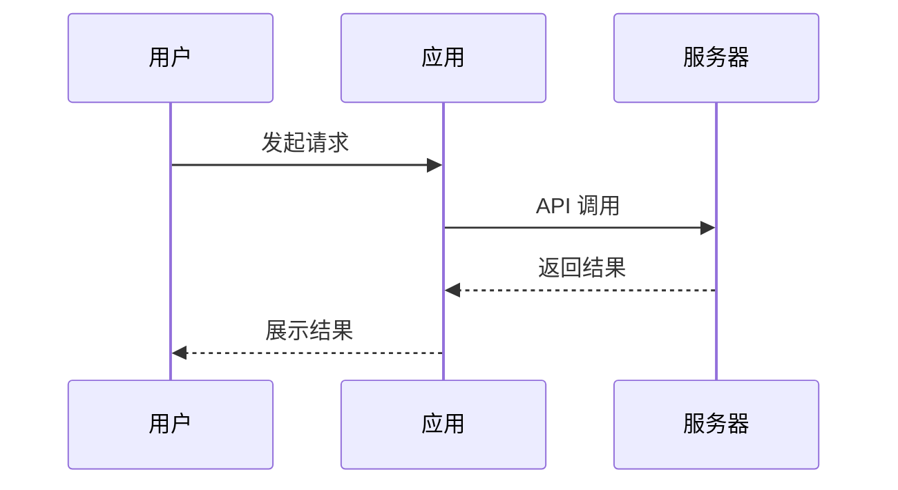
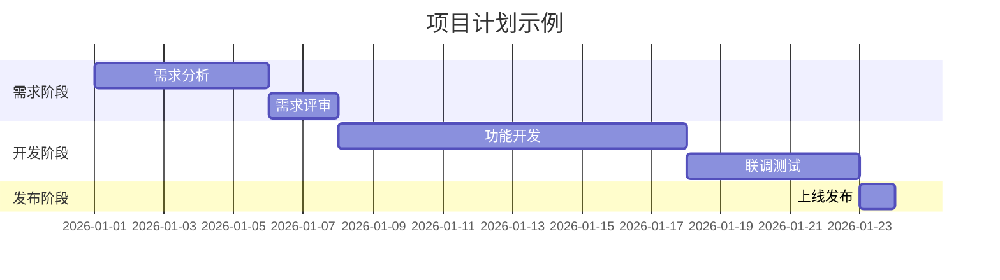
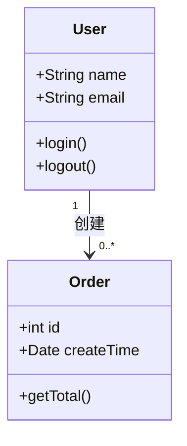
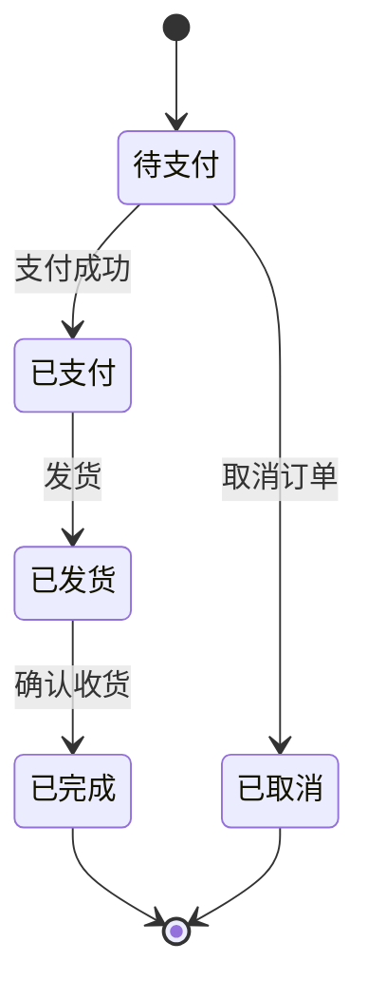
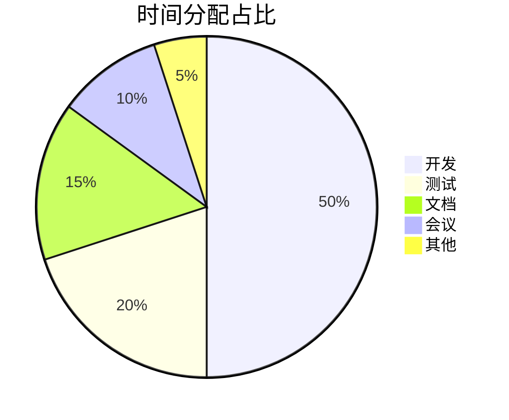

# uTools Markdown Preview

一款为 uTools 打造的高效 Markdown 预览插件，支持极速渲染、多窗口管理、Mermaid 绘图以及一键导出功能。

[](https://github.com/iblogc/utool-markdown-preview)

---

## ✨ 功能特性

- 🚀 **极速渲染**：采用 CSS 物理隔离与任务异步切片技术，万行大文件预览依然丝滑。
- 📱 **灵动工具栏**：方案 A 级底部悬浮中心设计，磨砂玻璃质感。采用**分类配色方案**（目录/Markdown/图片/HTML），操作直观且不干扰阅读。
- 📑 **智能目录 (TOC)**：自动提取标题生成平滑跳转目录，支持一键切换。
- 🛠️ **多窗口管理**：支持预览窗口复用、实时内容更新或同时开启多个预览窗口。
- 📊 **图表支持**：内置 **Mermaid** 引擎，支持流程图、时序图、甘特图等。
- 💻 **代码高亮**：标准的 GitHub 代码风格，适配多种编程语言。
- 🎨 **主题自适应**：深度适配 uTools 的深色/浅色模式，视觉感受高度统一。
- 💾 **多维导出与共享**：
  - **Markdown**：支持导出为 .md 源码到本地。
  - **预览图**：支持将 Markdown 一键渲染为高清图片并**保存**或**直接复制到剪贴板**，方便在社交软件中分享。
  - **HTML**：支持导出包含完整独立样式的 .html（保留图表与布局）。

## 🛠️ 使用方法

1. **复制内容**：在任何地方复制你想预览的 Markdown 源码。
2. **呼出插件**：在 uTools 搜索框输入 `md预览` 或 `markdown预览`。
3. **预览管理**：
   - 第一次进入自动开启预览。
   - 窗口已打开时，主界面提供 **“显示原预览”**、**“从剪贴板更新”** 和 **“打开新窗口”** 三个功能选项。
4. **查看与导出**：
   - 悬浮在底部的 **“灵动条”** 可进行目录切换和导出操作。

## ⚙️ 性能优化说明

针对大文件阅读进行了深度重构：
- **静态化布局**：固定 UI 结构，仅动态更新正文 DOM，减少重刷。
- **渲染隔离**：利用 `contain: content` 限制重排范围。
- **GPU 加速**：目录切换动画完全由 GPU 渲染，无卡顿。

## 📦 项目结构

```text
.
├── dist/
│   ├── plugin.json         # uTools 插件配置文件
│   ├── index.html          # 主界面入口 (提示/管理面板)
│   ├── index.js            # 核心业务逻辑 (React 实现)
│   ├── preload.js          # 主进程预加载脚本
│   ├── preview.html        # 核心预览 UI (性能优化版)
│   ├── preview_preload.js  # 预览窗口预加载驱动
│   └── logo.png            # 插件图标
```


## Mermaid 图表示例合集

### 流图（Flow）



### 序列图（Sequence）



### 甘特图（Gantt）



### 类图（Class）



### 状态迁移图（State）



### 饼分图（Pie）




## 📜 开源协议

本项目采用 [MIT License](LICENSE) 协议开源。
